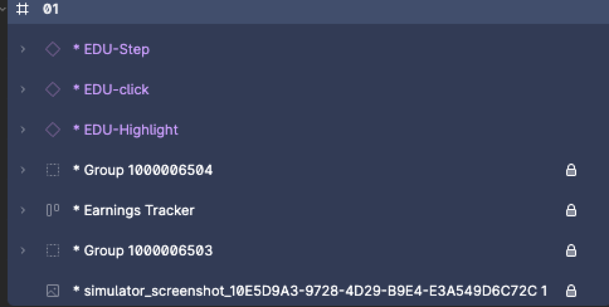
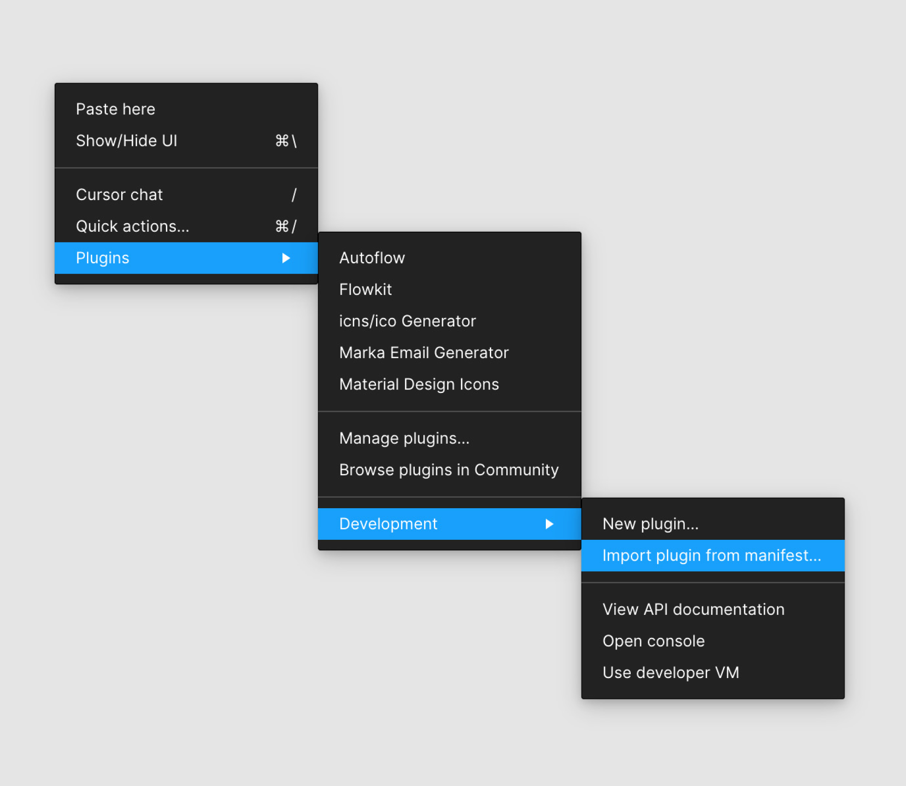
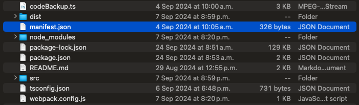
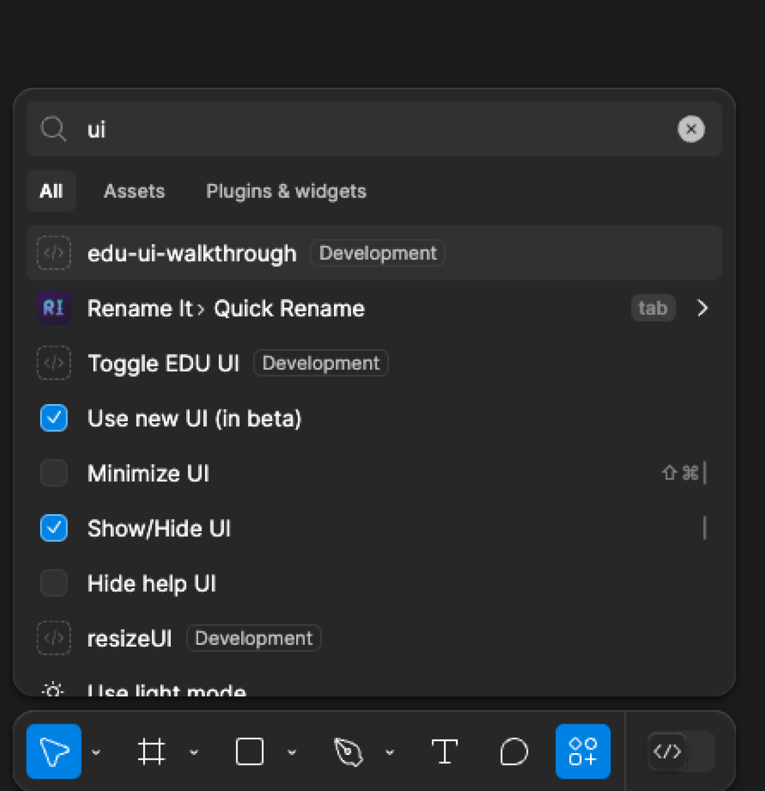

# Figma Script Documentation

## Overview

This script utilizes EDU UI Figma components to drive UI walkthrough animations in After Effects. It allows designers to create seamless and interactive UI animations by leveraging pre-built components.

## How It Works

1. **Place EDU UI Components**:
   - Use the EDU UI Figma components and place them over the UI screen you are working on.
   - Ensure that these components are placed in the highest hierarchy possible within a container Frame, as shown in the image below.

   

2. **Naming Conventions**:
   - In the current version (0.17), the names of the EDU components should NOT be modified. The script relies on these names to determine which animation is being used.

## Installation Process

1. **Download the Plugin**:
   - Download / Clone the GitHub repository.
2. **Copy Files**:
   - Copy the contents of the downloaded zip to a location that is not your downloads folder. If you delete these files after installing through the Development menu, it will break the plugin.

3. **Import Plugin**:
   - Right-click the canvas and navigate to `Plugins > Development > Import plugin from manifest...`.
    

   - Navigate to the folder you created in step 2, and select the `manifest.json` file.
    

4. **Access the Plugin**:
   - The panel will close and the UI walkthrough will now be available by:
     - Pressing `CMD+/` or `Ctrl+/` to open the Quick Actions menu and start typing 'edu-ui-walkthroughs', or
     - Right-clicking and navigating to `Plugins > Development > edu-ui-walkthrough`.
        

## How to Run the Plugin

1. **Select Frames**:
   - Before running the Figma script, select the Frames you want to export.

2. **Open Plugin Menu**:
   - Press the `⌘` (cmd) and `,` (comma) keys to open the plugin menu.

3. **Run the Script**:
   - Type `edu-ui-walkthrough` and press Enter.
   - The script will rename the selected Frames (in Left to Right order) as 01, 02, 03, etc.
     - *Note*: The order of selection doesn't matter; it uses the Frame's global x position on the canvas for the order.

4. **Save Exported Files**:
   - The script will prompt you to save a zip file. This file contains PNG exports of your frames and a JSON file necessary for the AE-walkthrough plugin.

## Usage Instructions

1. **Setup**:
   - Open your Figma project and navigate to the UI screen you want to animate.
   - Drag and drop the EDU UI components onto your screen.

2. **Hierarchy**:
   - Ensure that the components are placed at the highest hierarchy within a container Frame. This is crucial for the script to function correctly.

3. **Naming**:
   - Do not change the names of the EDU components. The script uses these names to identify and apply the correct animations.

## Example Use Cases

- Creating interactive UI walkthroughs for onboarding new users.
- Demonstrating new features or updates in a UI.
- Enhancing presentations with animated UI elements.

## Prerequisites

- Figma account with access to the EDU UI components.
- After Effects for rendering the animations.

## Dependencies

- EDU UI Figma components library.

README

This Figma plugin uses EDU-UI components to quickly mockup ui walkthroughs, this plugin exports
a zip file containing pngs and a json file.
The pngs are from selected frames or frames under a selected Figma "Section" using a 1290x2796 image resolution settings setting. 
The json contains each of the EDU-UI Components position, size and name, as well as the original Frame size.
The zip file should be unzipped in order to be read by the AE_Walkthroughs.jsx after effects script.

Changelog

### [V.17] - YYYY-MM-DD

#### Added

* Support for different original frame sizes (393px or 1290px width for Figma files or simulator).

### [V.16] - YYYY-MM-DD

#### Added

* Changelog with H and V scrolls
* EDU Figma to AE UI Walkthrough

### [V.15] - YYYY-MM-DD

#### Added

* EDU NLA Figma to AE UI Walkthrough (After Effects Property script)

### [V.13] - YYYY-MM-DD

#### Added

* ZIP file support (Figma plugin)

### [V.01] - YYYY-MM-DD

#### Added

* EDU NLA Mod of Duik's NLA

## To-do List

* Fix NLA animation properties scripted expression
* Change EDU-Highlight animation implementing NLA building blocks
* Add support for stacked highlights or scrolls
* Embed NLA and JSX to the zip file
* Make it template-less (remove the need for the extra "template" file)
